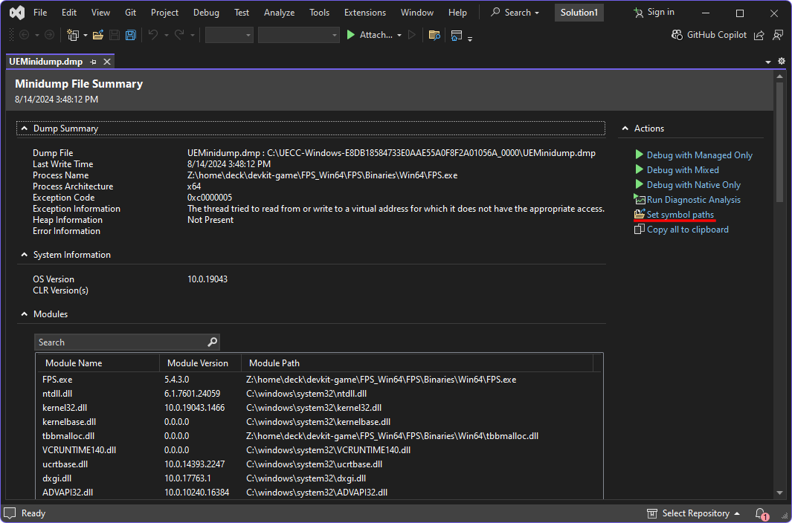
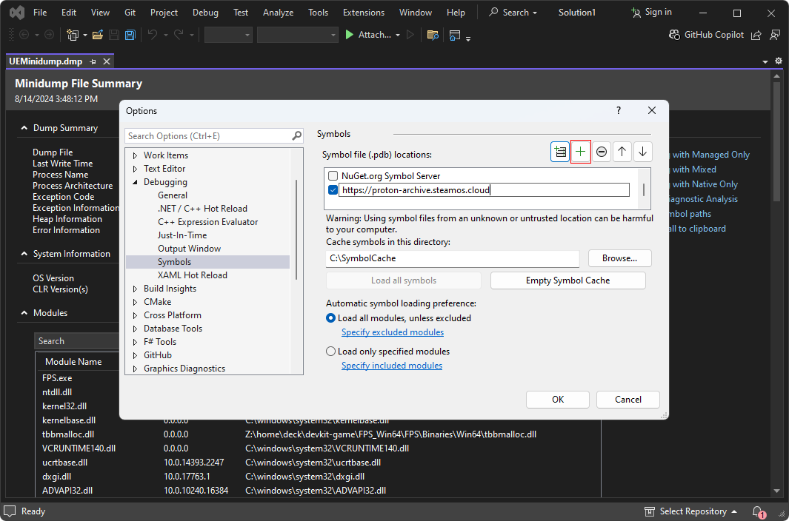
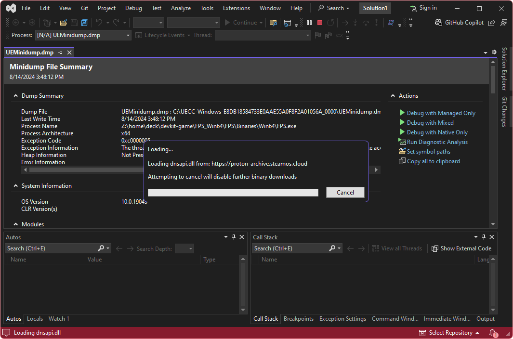
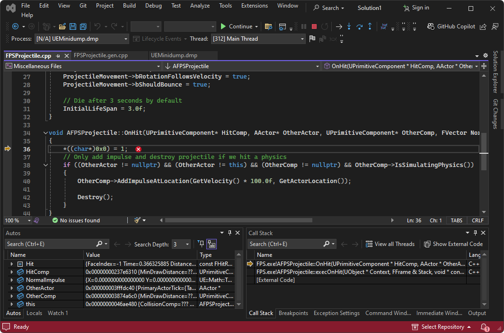
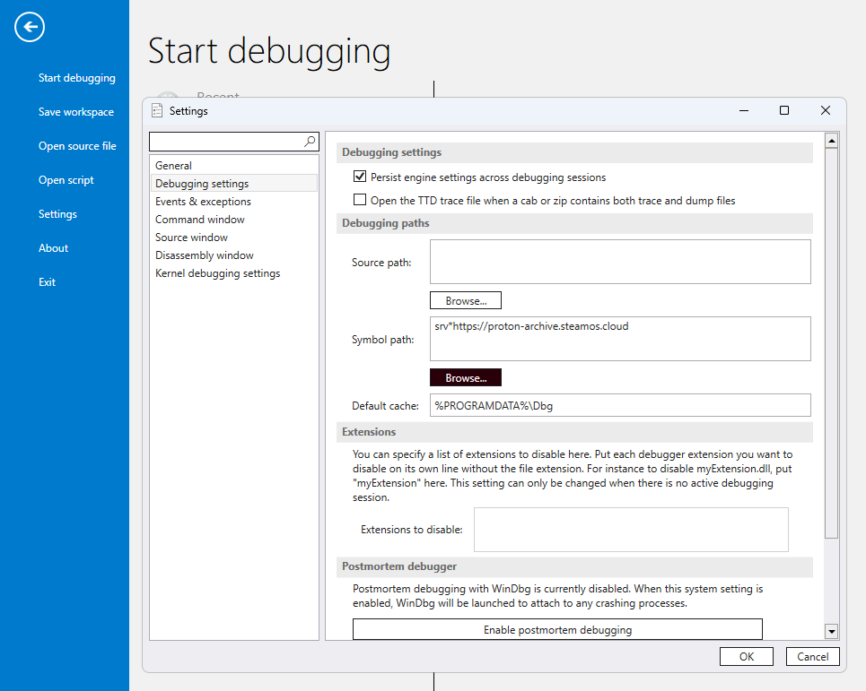
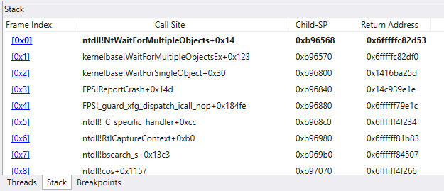
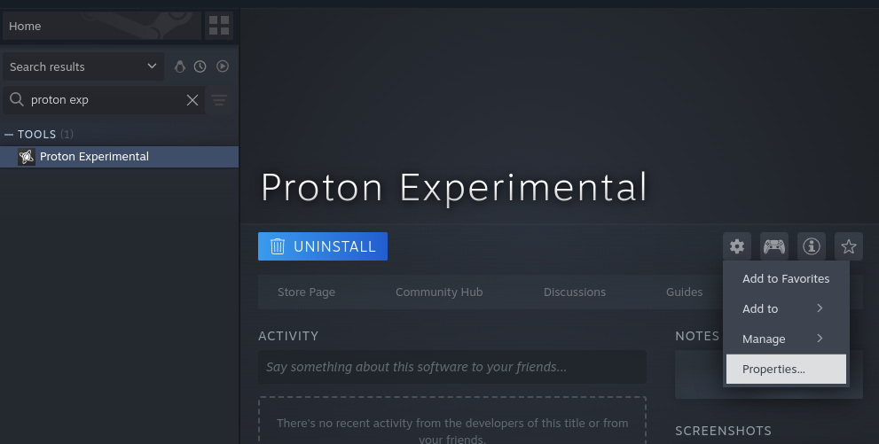
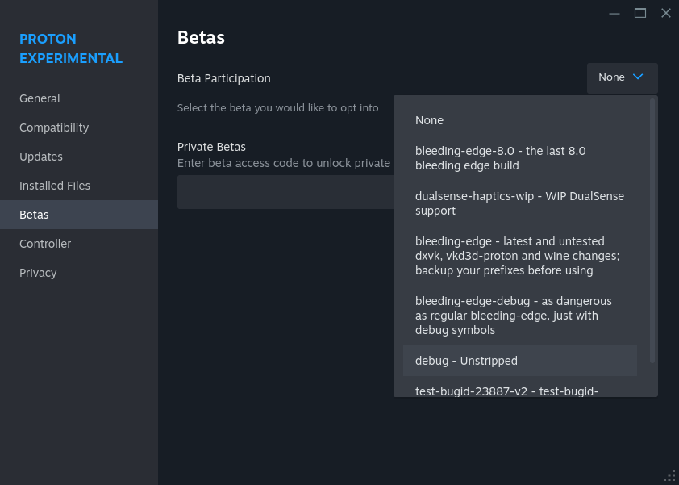

Proton Debugging Tips For Windows Developers
============================================

*This document is intended for people who are used to working with games natively
running on Windows and want to use familiar tools.*

Table Of Contents
-----------------

* [Analyzing Minidumps](#analyzing-minidumps)
  * [Introduction](#introduction)
  * [Visual Studio](#visual-studio)
  * [WinDbg](#windbg)
* [Live Debugging](#live-debugging)
  * [How To](#how-to)
  * [Getting A Debug Build Of Proton](#getting-a-debug-build-of-proton)

Analyzing Minidumps
-------------------

### Introduction

Starting Proton 9 every released build (includes stable and experimental) the
build is uploaded to a symbol store. Any tool that can understand those (e.g.
Visual Studio, WinDbg) can be pointed to
<https://proton-archive.steamos.cloud/>.

### Visual Studio

1. After opening a minidump in Visual Studio you need to click on "set symbol
paths" or click Tools -> Options -> Debugging -> Symbols. This is global and
needs to be done only once.

2. Click on the plus button and add <https://proton-archive.steamos.cloud/>.

3. Close the Options Window and proceed to any debugging action as you would
normally do. You should see symbols being loaded from the just added location.

4. Debugging should now work just like the native one including call stack,
variables, etc. Too see the Wine/Proton part of callstack you can select "show
external code".

### WinDbg

1. Click File -> Settings -> Debugging Settings
2. Enter `srv*https://proton-archive.steamos.cloud/` in the "symbol path" field.

4. Debugging should now work just like the native one including call stack,
variables, etc.

Live Debugging
--------------

### How To

For loading dev builds of games onto a Steam Deck see
<https://partner.steamgames.com/doc/steamdeck/loadgames>

For live debugging see
<https://partner.steamgames.com/doc/steamdeck/debugging>

For best results either add a symbol server to Visual Studio as described above
or use a debug build of Proton.

### Getting A Debug Build Of Proton

Debug builds contain symbols and should be used for live debugging session.

1. Locate the version of proton you are using in your Steam Library (e.g. Proton
Experimental), click on a cog and select properties.

2. In the "betas" tab select "debug - unstripped".

3. Chosen Proton version will now download and update and the symbols will be
available.
